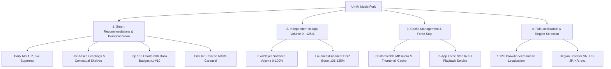

# 🎵 Umihi Music - Enhanced Features & Changelog

> **Fork Repository:** [ngoloc2k4/umihi-music](https://github.com/ngoloc2k4/umihi-music)  
> **Original Project:** [ilianoKokoro/umihi-music](https://github.com/ilianoKokoro/umihi-music)  
> **Direct APK Download:** [UmihiMusic.apk (Latest Releases)](https://github.com/ngoloc2k4/umihi-music/releases/download/latest/UmihiMusic.apk)

---

## 🌟 Key Highlights & Enhancements

This fork of **Umihi Music** includes powerful new personalization features, audio engineering enhancements, cache control, and full localization:

---

## 🚀 Detailed Features

### 🔊 1. Independent In-App Volume Control (0% – 125%)
- **Custom App Volume Mixer:** Adjust in-app volume without modifying master Android system or ringtone volume (especially useful on Android 7 - 9).
- **DSP Pre-Amp Gain Boost (101% – 125%):** Hardware-accelerated DSP **`android.media.audiofx.LoudnessEnhancer`** integration provides up to **+400 mB (~4dB)** boost with automatic limiting against audio distortion.
- **`VolumeBottomSheet`:** Fluid slider with haptic feedback, adaptive volume level icons, `⚡ Boost` badge, and quick preset buttons: `[0%]`, `[50%]`, `[80%]`, `[100%]`, `[⚡ 125%]`.
- **Playback Settings:** Easily accessible from either the Player screen or App Settings.

---

### 💿 2. Smart Personalized Recommendations
- **Parallel Asynchronous Loading:** Daily Mixes and recommendation shelves load concurrently in parallel via coroutines, cutting load latency by 3x.
- **Time-Based Context & Greetings:**
  - ☀️ **Morning (05:00 - 11:59):** *"☕ Morning Coffee & Good Vibes"*
  - 🌤️ **Afternoon (12:00 - 17:59):** *"💻 Deep Focus & Study Music"*
  - 🌆 **Evening (18:00 - 22:59):** *"🌇 Evening Wind Down"*
  - 🌙 **Late Night (23:00 - 04:59):** *"🌙 Night Sleep & Relaxing Beats"*
- **Daily Mixes (Mix 1, 2, 3):** Generates 20-track blended playlists combining top artists from SQLite Room playback history with similar tracks via YouTube Radio.
- **Favorite Artists Shelf:** Circular avatar carousel of most played artists with track counts.
- **Forgotten Favorites:** Recommends songs you previously loved that haven't been played in a while.
- **Cold-Start Fallback Discovery:** New users without playback history automatically get rich curated discovery shelves (Top V-Pop & Global Hits, Acoustic Cafe, OSTs).
- **Infinite Playlist Recommendations ("Recommended for this playlist"):**
  - Displays context-aware suggested tracks at the bottom of any playlist based on its current tracks (or playlist title).
  - **Endless / Infinite Scrolling:** Continuously fetches more fresh related songs as the user scrolls down, rotating seed songs to discover new tracks indefinitely.
  - **Playback Settings Toggle:** Configurable in **Settings -> Playback -> Infinite Playlist Suggestions**.
  - One-tap "Refresh Suggestions" button with smooth loading indicator.
  - Quick action to play, add to queue, or add to playlist.
- **Top 100 Charts with Rank Medals:** Songs in the Charts tab display **#1 (Gold 🥇)**, **#2 (Silver 🥈)**, **#3 (Bronze 🥉)**, and **#4+**.
- **Themed Collections:** Viral TikTok Hits, Movie & Drama OSTs, and Cafe Acoustic Chill.

---

### 🛑 3. In-App Force Stop (One-Tap Kill Playback)
- Instantly stops playback, clears audio buffers, abandons Audio Focus, dismisses the status bar Media Notification, and shuts down the Foreground Service without opening phone settings.

---

### 💾 4. Advanced Cache Management
- **Custom Cache Sizes:** Configure **Audio Cache (50–2000 MB)** and **Thumbnail Cache (20–500 MB)**.
- **One-Tap Cache Wipe:** Dedicated buttons to purge audio or thumbnail cache with confirmation dialogues.

---

### 🌍 5. Recommendation Region Selector & Full Vietnamese Localization
- **Recommendation Region Selector:** Switch country to Vietnam 🇻🇳, United States 🇺🇸, Japan 🇯🇵, South Korea 🇰🇷, etc.
- **100% Vietnamese Translation:** Full coverage translated via Crowdin (`upstream/translations`), localizing all navigation, dialogs, download notifications, and settings.

---

## 📋 Feature Test Checklist

| # | Feature | How to Test | Expected Result |
|---|---|---|---|
| 1 | **In-App Volume (0% - 100%)** | Tap Volume icon on Player screen / Settings | Volume changes smoothly without changing phone's master volume. |
| 2 | **Volume Boost (101% - 125%)** | Drag slider past 100% or tap `⚡ 125%` | Volume noticeably louder (+4dB boost) with red icon and Boost badge. |
| 3 | **Time Greeting & Shelf** | Top of Home screen (For You tab) | Shows correct greeting (Morning/Afternoon/Evening/Night) with contextual shelf. |
| 4 | **Favorite Artists Carousel** | Home screen | Displays circular artist avatars from your history. |
| 5 | **Daily Mixes (Mix 1, 2, 3)** | Home screen | Generates blended playlists combining top artists with fresh suggestions. |
| 6 | **Chart Rank Badges (#1, #2, #3)** | `🔥 Charts & Trending` tab | Shows rank medals `#1 (Gold)`, `#2 (Silver)`, `#3 (Bronze)`. |
| 7 | **Country / Region Selector** | Settings -> Recommendation Region | Switch between VN/US/JP/KR -> Regional charts adapt accordingly. |
| 8 | **Cache Management** | Settings -> Cache Management | Custom MB size saves; clearing audio/thumbnail cache works. |
| 9 | **Force Stop Playback** | Settings -> Actions | Playback stops, audio focus is released, Media Notification disappears. |
| 10 | **Full Localization** | Entire App | Full Vietnamese / English coverage with no missing strings. |
